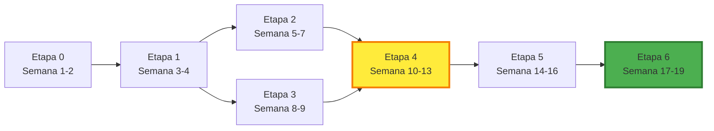

# Resumen de Etapas Incrementales

Este documento proporciona una vista rápida y condensada de las etapas de desarrollo del proyecto "pedidos-domicilio".

Para la versión completa con detalles exhaustivos, consulta **[ETAPAS_INCREMENTALES.md](./ETAPAS_INCREMENTALES.md)**.

---

## Vista Rápida del Desarrollo Incremental

```
ETAPA 0 (Base) → ETAPA 1 (Auth) → ETAPA 2 (Restaurantes) ──┐
                                                              ├→ ETAPA 4 (Pedidos) → ETAPA 5 (UX) → ETAPA 6 (Producción)
                                  ETAPA 3 (Repartidores) ────┘
```

---

## Tabla Resumen de Etapas

| # | Etapa | Duración | Componentes Principales | MVP? |
|---|-------|----------|-------------------------|------|
| **0** | **Infraestructura Base** | 1-2 sem | Docker, Frontend básico, API Gateway, DBs | ❌ |
| **1** | **Autenticación** | 1-2 sem | Servicio Auth, JWT, Login/Registro | ❌ |
| **2** | **Restaurantes** | 2-3 sem | Servicio Restaurantes, CRUD Menú, Stock | ❌ |
| **3** | **Repartidores** | 1-2 sem | Servicio Repartidores, Asignación atómica | ❌ |
| **4** | **Pedidos (Core)** | 3-4 sem | Servicio Pedidos, Integración E2E, Flujo completo | ✅ |
| **5** | **Mejoras UX** | 2-3 sem | Ratings, Dashboard, Notificaciones, Responsive | ❌ |
| **6** | **Producción** | 2-3 sem | Cache, Seguridad, Logging, CI/CD, Docs | ❌ |

**Duración Total:** 19-20 semanas (≈5 meses)

---

## Etapa 0: Infraestructura Base
**Objetivo:** Levantar la infraestructura base del proyecto

### Entregables Clave:
- ✅ Docker Compose funcional
- ✅ Frontend Flask accesible
- ✅ API Gateway con health check
- ✅ Bases de datos inicializadas

### Hito:
💡 Sistema puede levantarse con `docker-compose up --build`

---

## Etapa 1: Autenticación
**Objetivo:** Implementar autenticación con JWT

### Entregables Clave:
- ✅ Servicio de autenticación (MongoDB)
- ✅ Registro y login funcional
- ✅ Validación JWT en Gateway
- ✅ Frontend con login/logout

### Hito:
🔐 Usuarios pueden registrarse, autenticarse y acceder con tokens

---

## Etapa 2: Restaurantes
**Objetivo:** Gestionar restaurantes y menús

### Entregables Clave:
- ✅ CRUD de restaurantes (PostgreSQL)
- ✅ CRUD de menú con ítems
- ✅ Sistema de reserva/liberación de stock
- ✅ Frontend con catálogo de restaurantes
- ✅ Panel admin para gestión

### Hito:
🍕 Usuarios pueden ver restaurantes y menús; admins pueden gestionarlos

---

## Etapa 3: Repartidores
**Objetivo:** Gestionar flota de repartidores

### Entregables Clave:
- ✅ CRUD de repartidores (PostgreSQL)
- ✅ Gestión de estados (disponible/ocupado/desconectado)
- ✅ Sistema de asignación atómica
- ✅ Frontend con dashboard de repartidores

### Hito:
🚴 Sistema puede asignar repartidores de forma atómica sin race conditions

---

## Etapa 4: Pedidos (Core) 🎯 MVP
**Objetivo:** Implementar el flujo completo de pedidos

### Entregables Clave:
- ✅ Servicio de Pedidos (PostgreSQL + Redis)
- ✅ Creación de pedido con validación de stock
- ✅ Asignación inmediata de repartidor
- ✅ Background assigner para reintentos
- ✅ Transacciones distribuidas con compensación
- ✅ Frontend con carrito y checkout
- ✅ Vista de tracking de pedido
- ✅ Tests E2E completos

### Hito:
🎯 **SISTEMA FUNCIONAL END-TO-END**: Un usuario puede crear un pedido completo, se reserva el stock, se asigna un repartidor y se puede hacer tracking.

---

## Etapa 5: Mejoras UX
**Objetivo:** Pulir experiencia de usuario

### Entregables Clave:
- ✅ Sistema de ratings y comentarios
- ✅ Dashboard de usuario mejorado
- ✅ Panel admin con métricas
- ✅ Diseño responsive
- ✅ Notificaciones y alertas
- ✅ Búsqueda y filtros avanzados

### Hito:
✨ Sistema es agradable de usar con UX profesional

---

## Etapa 6: Producción
**Objetivo:** Preparar para despliegue productivo

### Entregables Clave:
- ✅ Caché con Redis implementado
- ✅ Auditoría de seguridad completada
- ✅ Logging centralizado
- ✅ Tests de carga y seguridad
- ✅ Documentación completa (API + Usuario)
- ✅ Pipeline CI/CD funcional
- ✅ Configuración multi-ambiente

### Hito:
🚀 Sistema listo para producción con monitoreo y seguridad

---

## Criterios de "Done" para cada Etapa

Una etapa está completa cuando cumple los **5 criterios FDID**:

1. **F**uncionalidad: Todos los entregables implementados y funcionando
2. **D**ocumentación: README, API docs, comentarios actualizados
3. **I**ntegración: Se integra con etapas previas sin romper nada
4. **D**emo: Se puede demostrar en vivo al stakeholder
5. **Tests**: Unitarios + integración pasando al 100%

---

## Hitos del Proyecto

| Semana | Hito | Descripción |
|--------|------|-------------|
| 2 | 🏗️ **Base Lista** | Infraestructura Docker funcional |
| 4 | 🔐 **Auth Completa** | Sistema de autenticación operativo |
| 7 | 🍕 **Catálogo Listo** | Restaurantes y menús gestionables |
| 9 | 🚴 **Flota Operativa** | Repartidores gestionables y asignables |
| 13 | 🎯 **MVP COMPLETO** | Flujo E2E de pedido funcional |
| 16 | ✨ **UX Profesional** | Sistema pulido y agradable |
| 19 | 🚀 **PRODUCCIÓN** | Sistema listo para desplegar |

---

## Ruta Crítica



---

## Backlog Priorizado (Orden de Implementación)

### Sprint 1-2 (Etapa 0)
- [ ] Configurar Docker Compose
- [ ] Levantar bases de datos
- [ ] Frontend Flask básico
- [ ] API Gateway esqueleto

### Sprint 3-4 (Etapa 1)
- [ ] Servicio autenticación + MongoDB
- [ ] Registro y login
- [ ] JWT en gateway
- [ ] UI login/logout

### Sprint 5-7 (Etapa 2)
- [ ] Servicio restaurantes + PostgreSQL
- [ ] CRUD restaurantes
- [ ] CRUD menú
- [ ] Sistema stock
- [ ] UI catálogo

### Sprint 8-9 (Etapa 3)
- [ ] Servicio repartidores + PostgreSQL
- [ ] CRUD repartidores
- [ ] Asignación atómica
- [ ] UI gestión repartidores

### Sprint 10-13 (Etapa 4) 🎯
- [ ] Servicio pedidos + PostgreSQL + Redis
- [ ] Crear pedido con validaciones
- [ ] Integración con restaurantes (stock)
- [ ] Integración con repartidores (asignación)
- [ ] Background assigner
- [ ] UI carrito y checkout
- [ ] UI tracking
- [ ] Tests E2E

### Sprint 14-16 (Etapa 5)
- [ ] Sistema ratings
- [ ] Dashboard usuario
- [ ] Panel admin métricas
- [ ] Responsive design
- [ ] Notificaciones

### Sprint 17-19 (Etapa 6)
- [ ] Cache Redis
- [ ] Seguridad + rate limiting
- [ ] Logging + monitoreo
- [ ] Tests de carga
- [ ] CI/CD pipeline
- [ ] Documentación final

---

## Velocidad del Equipo

Para estimar progreso, considera:

- **1 desarrollador:** 20 semanas (5 meses)
- **2 desarrolladores:** 12-14 semanas (3-3.5 meses) con trabajo paralelo
- **3+ desarrolladores:** 10-12 semanas (2.5-3 meses) optimizando paralelismo

### Trabajo Paralelo Posible:
- Etapas 2 y 3 pueden hacerse en paralelo después de Etapa 1
- Frontend y Backend de misma etapa pueden avanzar en paralelo
- Tests pueden escribirse en paralelo con desarrollo

---

## Riesgos por Etapa

| Etapa | Riesgo Principal | Mitigación |
|-------|------------------|------------|
| 0 | Problemas Docker/network | Probar conexiones entre contenedores temprano |
| 1 | Seguridad JWT | Usar librerías probadas, no reinventar |
| 2 | Complejidad de stock | Empezar simple, sin race conditions |
| 3 | Concurrencia en asignación | Usar SELECT FOR UPDATE correctamente |
| 4 | Transacciones distribuidas | Implementar saga pattern, compensación |
| 5 | Scope creep | Priorizar, posponer features no críticas |
| 6 | Presión de tiempo | Comenzar temprano, no dejar para el final |

---

## Checklist del Día a Día

### Al Comenzar una Etapa:
- [ ] Leer descripción completa en ETAPAS_INCREMENTALES.md
- [ ] Crear branch: `feature/etapa-N-nombre`
- [ ] Crear issues/cards en tablero para cada entregable
- [ ] Estimar esfuerzo de cada tarea
- [ ] Asignar responsables

### Durante Desarrollo:
- [ ] Commits atómicos y descriptivos
- [ ] Tests unitarios para nueva lógica
- [ ] Actualizar documentación si aplica
- [ ] Code review antes de merge
- [ ] CI pipeline verde

### Al Terminar una Etapa:
- [ ] Todos los entregables completados
- [ ] Todos los tests pasando
- [ ] Demo funcional preparada
- [ ] Merge a main/develop
- [ ] Tag de release: `etapa-N`
- [ ] Retrospectiva del equipo

---

## Enlaces Útiles

- 📖 [ETAPAS_INCREMENTALES.md](./ETAPAS_INCREMENTALES.md) - Versión completa y detallada
- 🏗️ [architecture.md](./architecture.md) - Arquitectura técnica del sistema
- 🔄 [INCREMENTAL.md](./INCREMENTAL.md) - Flujo de trabajo incremental (Git, PRs)
- 📋 [use-case.md](./use-case.md) - Caso de uso principal del sistema
- 🌐 [README.md](../README.md) - Guía de inicio rápido

---

## Visualizaciones

Para ver los diagramas visuales de las etapas:

```bash
# Diagrama de Gantt (timeline)
cat docs/etapas-incrementales.mmd | mermaid-cli

# Diagrama de dependencias
cat docs/etapas-dependencias.mmd | mermaid-cli
```

O abre los archivos `.mmd` en https://mermaid.live

---

**¿Preguntas?** Consulta la documentación completa o contacta al equipo.

---

**Última actualización:** 2025-11-17  
**Próxima revisión:** Al completar Etapa 4 (MVP)
