# Diagrama del API Gateway - Sistema Pedidos a Domicilio

## Arquitectura del API Gateway


---

## Flujo de Validación de Token JWT

```mermaid
sequenceDiagram
    participant Cliente
    participant Gateway as API Gateway
    participant Auth as Servicio Auth
    participant Service as Microservicio

    Note over Cliente,Service: 1. Login y obtención de token
    Cliente->>+Gateway: POST /api/v1/auth/login
    Gateway->>+Auth: POST /login (sin validar token)
    Auth-->>-Gateway: 200 OK {access_token, refresh_token}
    Gateway-->>-Cliente: 200 OK {tokens}

    Note over Cliente,Service: 2. Petición autenticada
    Cliente->>+Gateway: GET /api/v1/restaurantes<br/>Authorization: Bearer {token}

    alt Endpoint público (sin autenticación)
        Gateway->>Gateway: _is_auth_exempt() = true
        Gateway->>+Service: GET /api/v1/restaurantes
    else Endpoint protegido (requiere autenticación)
        Gateway->>Gateway: _verify_token_from_request()
        Gateway->>Gateway: jwt.decode(token, SECRET_KEY)

        alt Token válido
            Gateway->>Gateway: Extraer claims (sub, email, role)
            Gateway->>+Service: GET con headers:<br/>X-User-Id, X-User-Email, X-User-Role
            Service-->>-Gateway: 200 OK {data}
            Gateway-->>-Cliente: 200 OK {data}
        else Token inválido/expirado
            Gateway-->>Cliente: 401 Unauthorized<br/>"Invalid token"
        end
    end
```



---

## Rutas Públicas vs Protegidas

```mermaid
graph LR
    Request[HTTP Request] --> Gateway{API Gateway<br/>¿Endpoint público?}

    Gateway -->|Sí| Public[Rutas Públicas]
    Gateway -->|No| Protected[Rutas Protegidas]

    Public --> NoAuth[Sin validación JWT]
    NoAuth --> Forward1[Forward directo]

    Protected --> Validate[Validar JWT]
    Validate -->|Token válido| AddHeaders[Agregar headers<br/>X-User-*]
    Validate -->|Token inválido| Reject[401 Unauthorized]
    AddHeaders --> Forward2[Forward con contexto]

    Forward1 --> Service[Microservicio]
    Forward2 --> Service

    style Public fill:#4caf50,color:#fff
    style Protected fill:#f44336,color:#fff
    style Validate fill:#ff9800,color:#fff
```



### Configuración de Rutas Públicas

**Variable de entorno:** `PUBLIC_ROUTES`
```bash
PUBLIC_ROUTES=auth:login,auth:register,auth:health,restaurantes:*
```

**Formato:** `servicio:ruta` o `servicio:ruta*` (wildcard)

**Ejemplos:**
- `auth:login` → `/api/v1/auth/login` es público
- `auth:register` → `/api/v1/auth/register` es público
- `restaurantes:*` → Todas las rutas de restaurantes son públicas
- Sin coincidencia → Ruta protegida (requiere JWT)

---

## Mapeo de Servicios

```mermaid
graph TB
    subgraph "API Gateway - Puerto 8000"
        Route[/api/v1/{service}/{path}]
    end

    subgraph "Mapeo de URLs"
        AuthMap[auth → http://authentication:8001]
        RestMap[restaurantes → http://restaurantes-service:8002]
        PedMap[pedidos → http://pedidos-service:8003]
        RepMap[repartidores → http://repartidores-service:8004]
    end

    subgraph "Servicios Internos"
        AuthSvc[Authentication:8001]
        RestSvc[Restaurantes:8002]
        PedSvc[Pedidos:8003]
        RepSvc[Repartidores:8004]
    end

    Route --> AuthMap
    Route --> RestMap
    Route --> PedMap
    Route --> RepMap

    AuthMap --> AuthSvc
    RestMap --> RestSvc
    PedMap --> PedSvc
    RepMap --> RepSvc

    style Route fill:#ff9800,color:#fff
    style AuthMap,RestMap,PedMap,RepMap fill:#2196f3,color:#fff
```

### Ejemplos de Transformación de URLs

| Request al Gateway | URL Interna al Microservicio |
|-------------------|-------------------------------|
| `GET /api/v1/auth/login` | `http://authentication:8001/login` |
| `POST /api/v1/auth/register` | `http://authentication:8001/register` |
| `GET /api/v1/restaurantes` | `http://restaurantes-service:8002/api/v1/restaurantes` |
| `GET /api/v1/restaurantes/123/menu` | `http://restaurantes-service:8002/api/v1/restaurantes/123/menu` |
| `POST /api/v1/pedidos` | `http://pedidos-service:8003/api/v1/pedidos` |
| `POST /api/v1/repartidores/assign-next` | `http://repartidores-service:8004/api/v1/repartidores/assign-next` |

**Nota especial:** El servicio de autenticación (`auth`) no usa prefijo `/api/v1/auth` internamente, sus endpoints están en raíz (`/login`, `/register`). Los demás servicios sí mantienen su prefijo interno.

---

## Métodos HTTP Soportados


**Handlers implementados:**
- ✅ **GET** → `forward_get()` - Consultas, listados
- ✅ **POST** → `forward_post()` - Creación, operaciones
- ✅ **PUT** → `forward_put()` - Actualización completa
- ✅ **DELETE** → `forward_delete()` - Eliminación
- ⚠️ **PATCH** → No implementado (puede agregarse similar a PUT)

---

## Proceso de Forwarding de Peticiones

```mermaid
sequenceDiagram
    participant Cliente
    participant Gateway
    participant TokenValidator as Validador JWT
    participant Service as Microservicio

    Cliente->>+Gateway: HTTP Request<br/>Authorization: Bearer {token}

    Gateway->>Gateway: 1. Validar service_name existe

    alt Servicio no encontrado
        Gateway-->>Cliente: 404 "Service not found"
    end

    Gateway->>Gateway: 2. Construir service_url

    Gateway->>TokenValidator: 3. ¿Es endpoint público?

    alt Endpoint público
        TokenValidator-->>Gateway: Sí, skip JWT
    else Endpoint protegido
        TokenValidator->>TokenValidator: jwt.decode(token)
        alt Token válido
            TokenValidator-->>Gateway: Claims: {sub, email, role}
            Gateway->>Gateway: 4. Agregar headers:<br/>X-User-Id<br/>X-User-Email<br/>X-User-Role
        else Token inválido
            TokenValidator-->>Gateway: JWTError
            Gateway-->>Cliente: 401 "Invalid token"
        end
    end

    Gateway->>+Service: 5. Forward request<br/>+ headers + query params + body

    alt Respuesta exitosa
        Service-->>-Gateway: 200/201 {data}
        Gateway-->>-Cliente: Status + JSON
    else Error del servicio
        Service-->>Gateway: 4xx/5xx {error}
        Gateway-->>Cliente: Status + JSON
    else Error de red
        Gateway-->>Cliente: 500 "Error forwarding request"
    end
```



---

## Headers Agregados por el Gateway

```mermaid
graph TB
    Request[Request Original]

    subgraph "Extracción del JWT"
        JWT[Token JWT]
        Decode[jwt.decode]
        Claims[Claims:<br/>sub, email, role]
    end

    subgraph "Headers Agregados"
        H1[X-User-Id: {sub}]
        H2[X-User-Email: {email}]
        H3[X-User-Role: {role}]
    end

    subgraph "Request Modificado"
        Modified[Request + Headers]
    end

    Request --> JWT
    JWT --> Decode
    Decode --> Claims

    Claims --> H1
    Claims --> H2
    Claims --> H3

    Request --> Modified
    H1 --> Modified
    H2 --> Modified
    H3 --> Modified

    Modified --> Service[Microservicio<br/>recibe contexto de usuario]

    style JWT fill:#ff9800,color:#fff
    style Claims fill:#2196f3,color:#fff
    style Modified fill:#4caf50,color:#fff
```

**Beneficios:**
- ✅ Los microservicios no necesitan validar JWT
- ✅ Contexto de usuario disponible sin parsear token
- ✅ Simplifica lógica de autorización en servicios
- ✅ Single point of authentication

---

## Manejo de Errores

```mermaid
graph TB
    Request[Request]

    Gateway{API Gateway}

    Request --> Gateway

    Gateway --> E1{Servicio<br/>existe?}
    E1 -->|No| R1[404 Service not found]
    E1 -->|Sí| E2

    E2{Token<br/>requerido?}
    E2 -->|Sí| E3{Token<br/>válido?}
    E2 -->|No| Forward

    E3 -->|No| R2[401 Invalid token]
    E3 -->|Sí| Forward

    Forward[Forward a Servicio]
    Forward --> E4{Conexión<br/>exitosa?}

    E4 -->|No| R3[500 Error forwarding request]
    E4 -->|Sí| E5{Respuesta<br/>válida?}

    E5 -->|JSON| R4[Status + JSON response]
    E5 -->|No JSON| R5[Status + {detail: text}]

    style R1 fill:#f44336,color:#fff
    style R2 fill:#f44336,color:#fff
    style R3 fill:#f44336,color:#fff
    style R4 fill:#4caf50,color:#fff
    style R5 fill:#ff9800,color:#fff
```

### Códigos de Error Comunes

| Código | Origen | Descripción |
|--------|--------|-------------|
| **401** | Gateway | Missing Authorization header |
| **401** | Gateway | Invalid token (JWT decode error) |
| **404** | Gateway | Service not found (service_name no existe) |
| **500** | Gateway | Error forwarding request (timeout, conexión) |
| **4xx/5xx** | Microservicio | Errores del servicio destino (forwarded transparently) |

---

## Configuración y Variables de Entorno

```mermaid
graph TB
    subgraph "Variables de Entorno"
        V1[JWT_SECRET<br/>default: change-me-in-production]
        V2[JWT_ALGORITHM<br/>default: HS256]
        V3[PUBLIC_ROUTES<br/>default: auth:login,auth:register,...]
        V4[AUTH_SERVICE_URL<br/>default: http://authentication:8001]
        V5[RESTAURANTES_URL<br/>default: http://restaurantes-service:8002]
        V6[PEDIDOS_URL<br/>default: http://pedidos-service:8003]
        V7[REPARTIDORES_URL<br/>default: http://repartidores-service:8004]
    end

    subgraph "Configuración del Gateway"
        Secret[SECRET_KEY]
        Algo[ALGORITHM]
        Public[_public_patterns]
        Services[SERVICES dict]
    end

    V1 --> Secret
    V2 --> Algo
    V3 --> Public
    V4 --> Services
    V5 --> Services
    V6 --> Services
    V7 --> Services

    Secret --> JWT[Validación JWT]
    Algo --> JWT
    Public --> Auth[Decisión de autenticación]
    Services --> Route[Routing de peticiones]

    style V1,V2 fill:#f44336,color:#fff
    style V3 fill:#ff9800,color:#fff
    style V4,V5,V6,V7 fill:#2196f3,color:#fff
```



---

## Middleware CORS

```mermaid
graph LR
    Request[Request Origen Cruzado<br/>Origin: http://localhost:3000]

    CORS[CORS Middleware]

    Request --> CORS

    CORS -->|allow_origins: *| Accept[Permitir Origen]
    CORS -->|allow_credentials: true| Cookies[Permitir Cookies]
    CORS -->|allow_methods: *| Methods[Permitir Métodos]
    CORS -->|allow_headers: *| Headers[Permitir Headers]

    Accept --> Response[Response con headers CORS]
    Cookies --> Response
    Methods --> Response
    Headers --> Response

    Response --> Client[Cliente recibe respuesta]

    style CORS fill:#9c27b0,color:#fff
    style Response fill:#4caf50,color:#fff
```



**Headers CORS agregados:**
```http
Access-Control-Allow-Origin: *
Access-Control-Allow-Credentials: true
Access-Control-Allow-Methods: *
Access-Control-Allow-Headers: *
```

**⚠️ Nota de seguridad:** En producción, cambiar `allow_origins=["*"]` por lista específica de dominios permitidos.

---

## Flujo Completo: Crear Pedido


---

## Logging y Monitoreo

```mermaid
graph TB
    Request[Request]

    Gateway[API Gateway]

    Request --> Gateway

    Gateway --> L1[Log: Forwarding {method} to {url}]
    L1 --> Forward[Forward Request]
    Forward --> L2[Log: Downstream responded {status}]

    L2 --> Success{Exitoso?}

    Success -->|Sí| L3[Log: JSON response]
    Success -->|No| L4[Log: Non-JSON body]

    L3 --> Response[Response al Cliente]
    L4 --> Response

    style L1 fill:#2196f3,color:#fff
    style L2 fill:#2196f3,color:#fff
    style L3 fill:#4caf50,color:#fff
    style L4 fill:#ff9800,color:#fff
```

**Logs generados:**
```python
[GATEWAY] Forwarding GET to http://restaurantes-service:8002/api/v1/restaurantes query={'limit': 10} headers=['authorization', 'x-user-id']
[GATEWAY] Downstream restaurantes responded 200
[GATEWAY] Downstream returned non-json body: <html>...
```

---

## Ventajas de esta Arquitectura

```mermaid
mindmap
  root((API Gateway))
    Seguridad
      Single Point of Authentication
      Validación JWT centralizada
      Headers de usuario agregados
      Control de rutas públicas/privadas

    Simplicidad
      Un endpoint para clientes
      Routing automático
      No CORS en microservicios
      Microservicios sin lógica JWT

    Escalabilidad
      Microservicios independientes
      Load balancing futuro
      Circuit breaker posible
      Rate limiting centralizado

    Mantenibilidad
      Cambios de URL transparentes
      Logging centralizado
      Fácil agregar servicios
      Configuración por env vars
```



### Ventajas Detalladas

✅ **Single Entry Point**: Un solo endpoint para todos los clientes
✅ **Autenticación Centralizada**: JWT validado una sola vez en el gateway
✅ **Desacoplamiento**: Microservicios no conocen lógica de autenticación
✅ **Routing Dinámico**: Agregar servicios sin cambiar clientes
✅ **Headers Contextuales**: User info disponible sin parsear token
✅ **CORS Centralizado**: Un solo punto de configuración
✅ **Logging Unificado**: Trazabilidad de todas las peticiones
✅ **Fácil Extensión**: Agregar rate limiting, circuit breaker, etc.

---

## Tecnologías Utilizadas

| Componente | Tecnología | Propósito |
|-----------|------------|-----------|
| Framework | FastAPI | API Gateway HTTP |
| JWT | python-jose | Validación de tokens |
| HTTP Client | requests | Forward a microservicios |
| CORS | fastapi.middleware.cors | Cross-origin requests |
| Logging | logging | Monitoreo y debugging |
| Deployment | Docker | Contenedor en puerto 8000 |

---

## Endpoints del Gateway

### Health Check
```http
GET /health
```
**Response:**
```json
{
  "status": "ok",
  "message": "API Gateway is running."
}
```

### Forward Pattern
```http
{METHOD} /api/v1/{service_name}/{path}
```

**Ejemplos:**
```http
GET /api/v1/auth/login
POST /api/v1/auth/register
GET /api/v1/restaurantes
GET /api/v1/restaurantes/123/menu
POST /api/v1/pedidos
POST /api/v1/repartidores/assign-next
PUT /api/v1/restaurantes/123
DELETE /api/v1/restaurantes/123
```

---

**Última actualización**: Noviembre 2025
**Versión**: 1.0
**Puerto**: 8000
