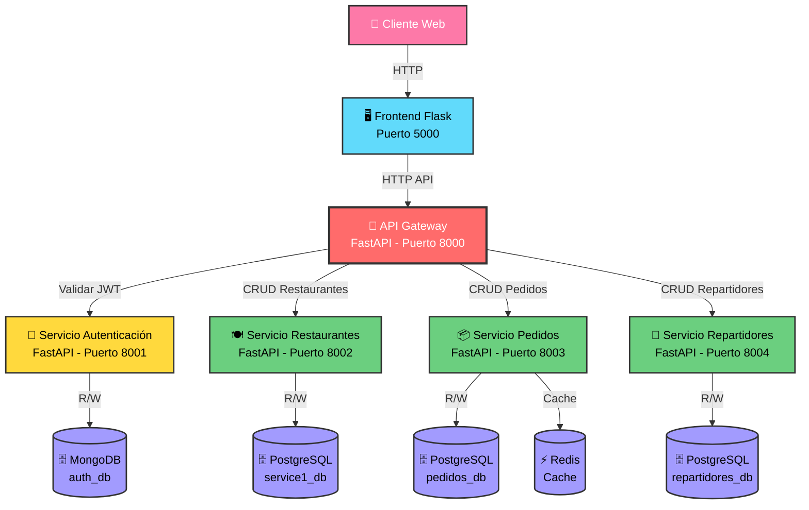
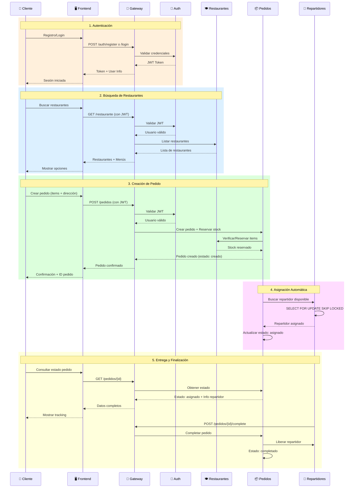

# Diagrama de Arquitectura - Sistema Pedidos a Domicilio

## Flujo de Interacción de Componentes

## Flujo Detallado de Operaciones

## Descripción de Componentes

### 🖥️ Frontend (Flask - Puerto 5000)
- Interfaz web responsive
- Dashboards por rol (Cliente, Restaurante, Repartidor)
- Manejo de sesiones JWT
- Polling para actualizaciones en tiempo real

### 🚪 API Gateway (FastAPI - Puerto 8000)
- **Punto único de entrada** para todas las peticiones
- Validación centralizada de JWT
- Enrutamiento a microservicios
- Inyección de headers `X-User-Id` y `X-User-Email`

### 🔐 Servicio de Autenticación (Puerto 8001)
- Registro de usuarios (Cliente, Restaurante, Repartidor)
- Generación de tokens JWT
- Validación de credenciales con bcrypt
- Base de datos: MongoDB

### 🍽️ Servicio de Restaurantes (Puerto 8002)
- CRUD de restaurantes y menús
- Control de stock en tiempo real
- Upload y serving de imágenes
- Base de datos: PostgreSQL

### 📦 Servicio de Pedidos (Puerto 8003)
- Creación de pedidos con reserva atómica
- Gestión de estados: `creado` → `asignado` → `completado`
- Estadísticas de ventas por restaurante
- Base de datos: PostgreSQL + Redis

### 🚚 Servicio de Repartidores (Puerto 8004)
- CRUD de repartidores
- Asignación atómica con `SELECT FOR UPDATE SKIP LOCKED`
- Background thread para asignación automática
- Base de datos: PostgreSQL

## Tecnologías Utilizadas

| Componente | Tecnología | Puerto |
|-----------|-----------|--------|
| Frontend | Flask + Jinja2 | 5000 |
| API Gateway | FastAPI | 8000 |
| Autenticación | FastAPI + MongoDB | 8001 |
| Restaurantes | FastAPI + PostgreSQL | 8002 |
| Pedidos | FastAPI + PostgreSQL + Redis | 8003 |
| Repartidores | FastAPI + PostgreSQL | 8004 |

## Patrones de Arquitectura

- ✅ **Microservicios**: Servicios independientes con bases de datos dedicadas
- ✅ **API Gateway Pattern**: Punto único de entrada y autenticación centralizada
- ✅ **Database per Service**: Cada microservicio con su propia BD
- ✅ **JWT Authentication**: Autenticación stateless con tokens
- ✅ **Atomic Operations**: Transacciones ACID con `SELECT FOR UPDATE`
