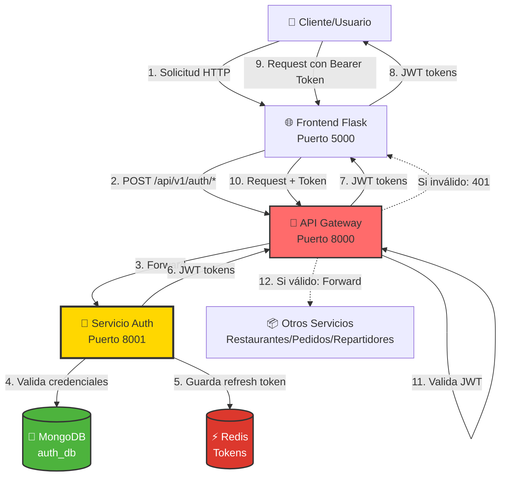
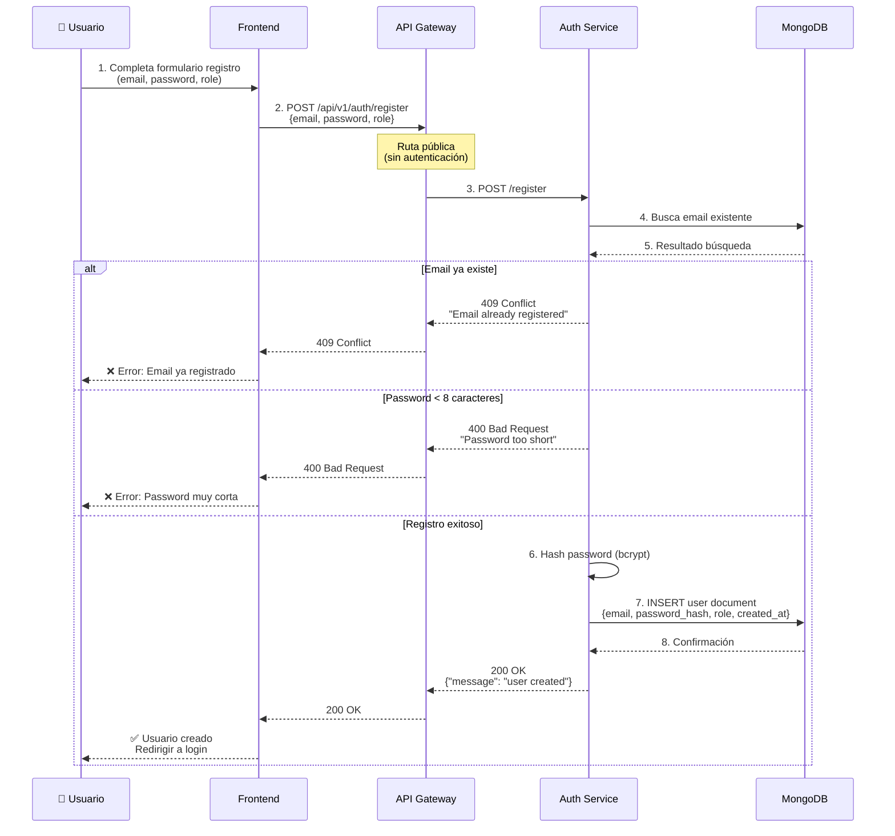
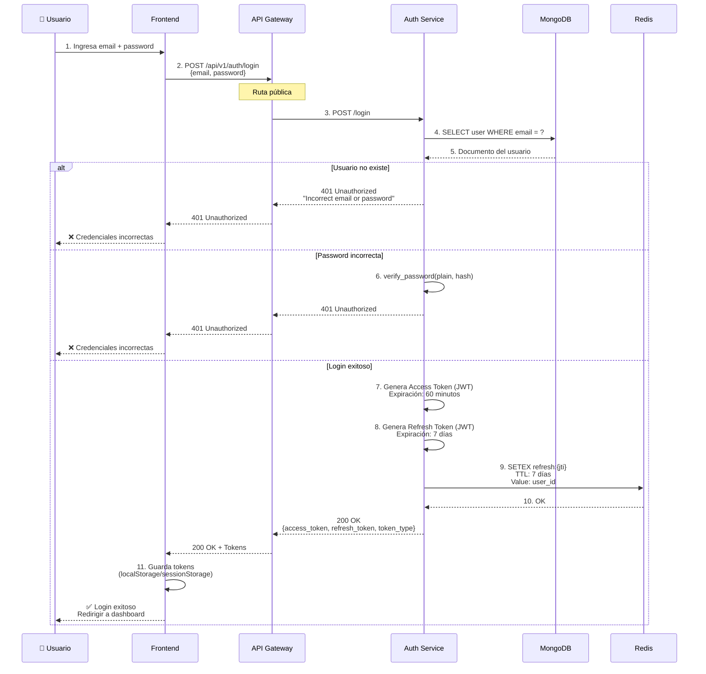
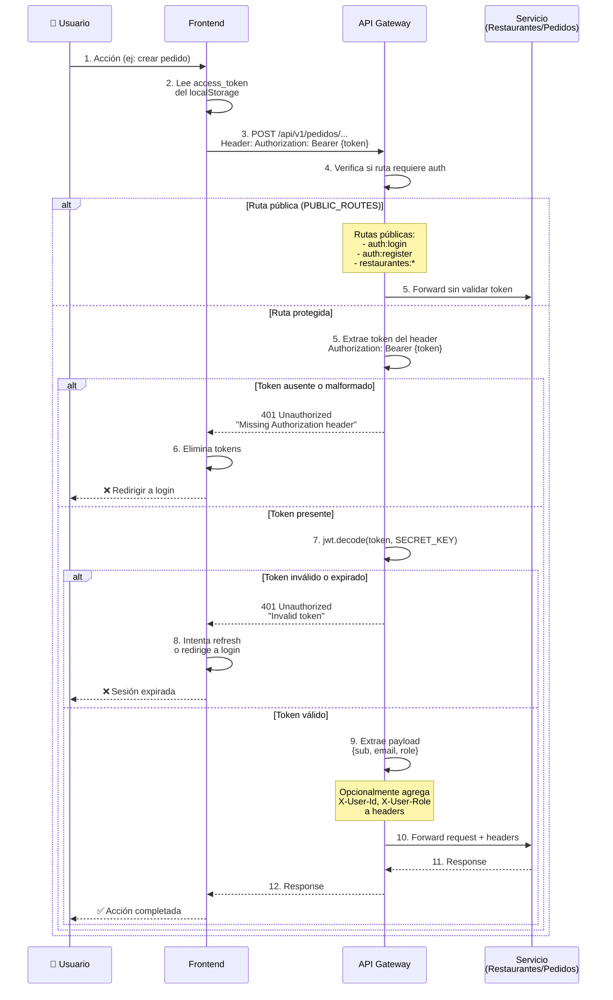
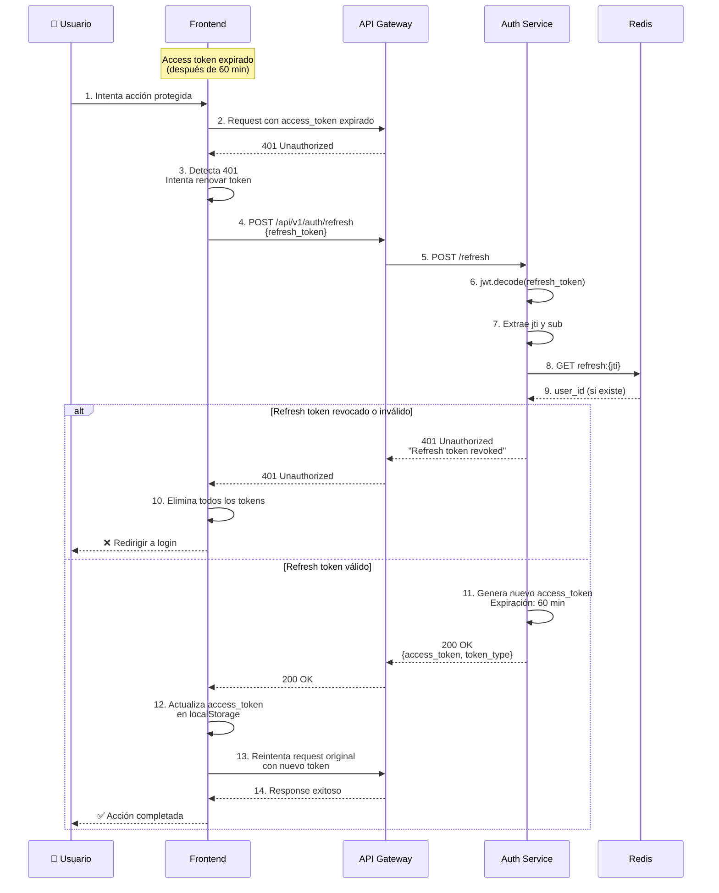
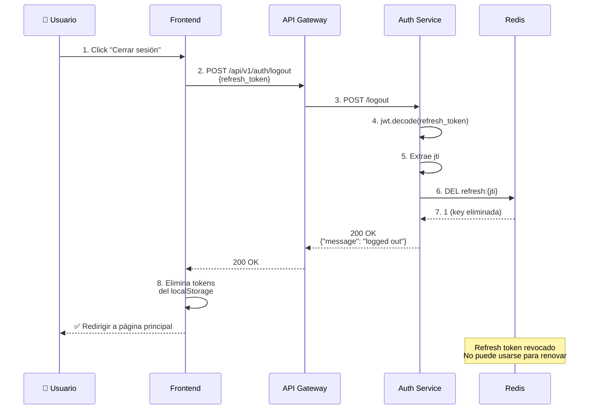
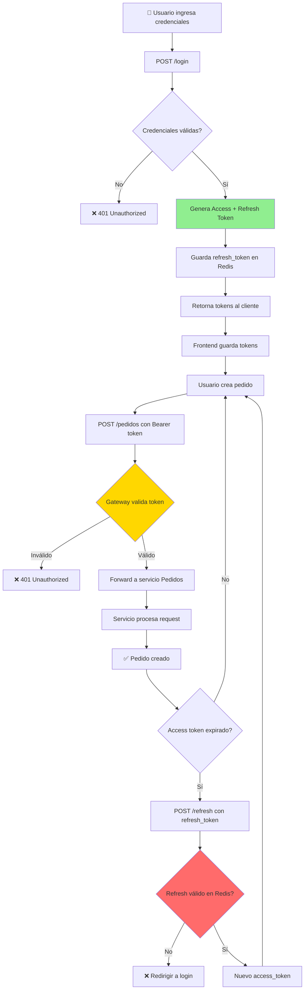
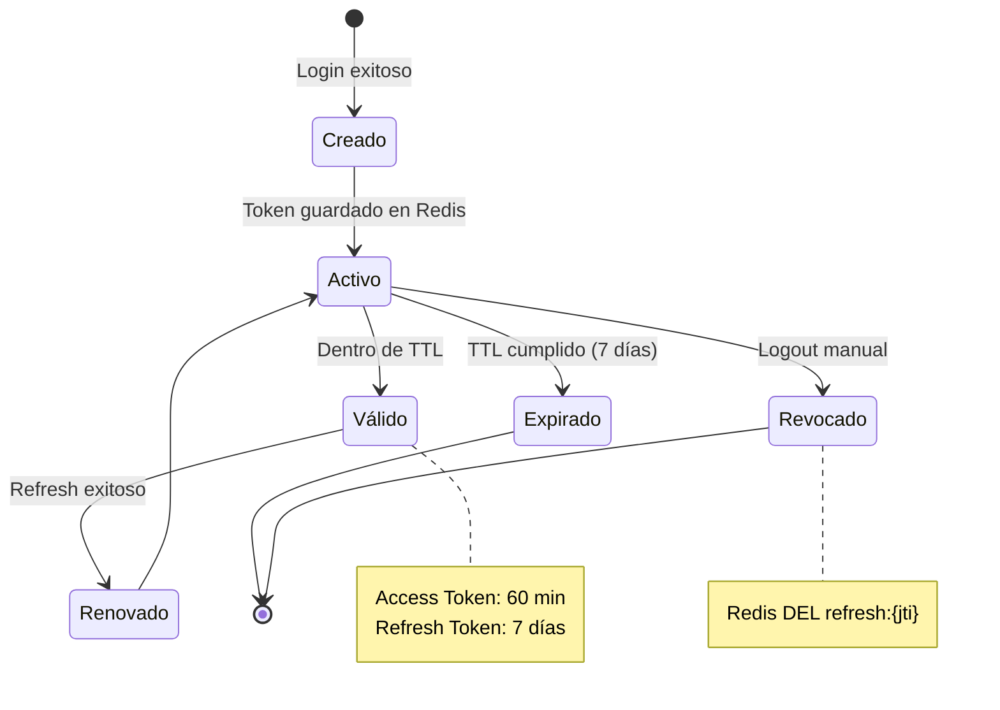

# Diagrama de Autenticación - Sistema Pedidos a Domicilio

## Arquitectura de Autenticación



---

## Flujo de Registro (Sign Up)



**Estructura del documento en MongoDB:**
```javascript
{
  "_id": ObjectId("..."),
  "email": "usuario@ejemplo.com",
  "password": "$pbkdf2-sha256$...",  // Hash bcrypt
  "role": "cliente",  // cliente | restaurante | repartidor
  "created_at": ISODate("2025-11-23T...")
}
```

---

## Flujo de Login (Sign In)



**Tokens generados:**

### Access Token (JWT)
```json
{
  "sub": "673a21f0e4b0c8a9d1234567",  // user_id
  "email": "usuario@ejemplo.com",
  "role": "cliente",
  "exp": 1732395600  // Expira en 60 minutos
}
```

### Refresh Token (JWT)
```json
{
  "sub": "673a21f0e4b0c8a9d1234567",
  "email": "usuario@ejemplo.com",
  "role": "cliente",
  "jti": "550e8400-e29b-41d4-a716-446655440000",  // UUID único
  "exp": 1732999800  // Expira en 7 días
}
```

**Almacenamiento en Redis:**
```
Key: refresh:550e8400-e29b-41d4-a716-446655440000
Value: 673a21f0e4b0c8a9d1234567
TTL: 604800 segundos (7 días)
```

---

## Flujo de Peticiones Autenticadas



---

## Flujo de Refresh Token



---

## Flujo de Logout



---

## Endpoints de Autenticación

### Públicos (sin autenticación requerida)

| Método | Ruta | Descripción | Request Body | Response |
|--------|------|-------------|--------------|----------|
| POST | `/register` | Registrar nuevo usuario | `{email, password, role?}` | `{message: "user created"}` |
| POST | `/login` | Iniciar sesión | `{email, password}` | `{access_token, refresh_token, token_type}` |
| POST | `/refresh` | Renovar access token | `{refresh_token}` | `{access_token, token_type}` |
| POST | `/logout` | Cerrar sesión | `{refresh_token}` | `{message: "logged out"}` |
| GET | `/health` | Health check | - | `{status: "ok"}` |

### Protegidos (requieren Bearer token)

| Método | Ruta | Descripción | Requiere Rol | Response |
|--------|------|-------------|--------------|----------|
| GET | `/me` | Datos del usuario actual | Cualquiera | `{user: {...}}` |
| GET | `/users` | Listar todos los usuarios | `admin` | `{users: [...]}` |
| GET | `/users/{user_id}` | Ver usuario específico | `admin` o el mismo usuario | `{user: {...}}` |

---

## Configuración de Rutas Públicas en API Gateway

El gateway determina qué rutas NO requieren autenticación mediante la variable de entorno `PUBLIC_ROUTES`:

```bash
PUBLIC_ROUTES="auth:login,auth:register,auth:health,restaurantes:*"
```

**Formato:** `servicio:ruta[*]`
- `auth:login` → Permite `/api/v1/auth/login`
- `auth:register` → Permite `/api/v1/auth/register`
- `restaurantes:*` → Permite **todas** las rutas de restaurantes (wildcard)

---

## Seguridad Implementada

### 🔒 Medidas de Seguridad

| Componente | Implementación |
|-----------|----------------|
| **Hashing de passwords** | PBKDF2-SHA256 vía Passlib |
| **Tokens JWT** | Firmados con HS256 + SECRET_KEY |
| **Access token TTL** | 60 minutos (corta vida) |
| **Refresh token TTL** | 7 días (revocable) |
| **Revocación de tokens** | Redis con TTL automático |
| **Validación centralizada** | En API Gateway |
| **Índices únicos** | Email único en MongoDB |
| **CORS configurado** | Middleware en Gateway |
| **Password mínimo** | 8 caracteres (validación backend) |

### 🔐 Almacenamiento de Secrets

```yaml
# Variables de entorno (.env)
JWT_SECRET=tu-secreto-super-seguro-cambiar-en-produccion
JWT_ALGORITHM=HS256
AUTH_DATABASE_URL=mongodb://auth-db:27017/auth_db
REDIS_URL=redis://redis:6379/0
```

⚠️ **Importante:** El `JWT_SECRET` debe ser el mismo en:
- Servicio de Autenticación (genera tokens)
- API Gateway (valida tokens)

---

## Flujo Completo: Desde Login hasta Acción Protegida



---

## Roles de Usuario

| Role | Descripción | Permisos |
|------|-------------|----------|
| **cliente** | Usuario final que hace pedidos | Crear pedidos, ver menús |
| **restaurante** | Dueño de restaurante | Gestionar menú, ver pedidos propios |
| **repartidor** | Delivery | Ver pedidos asignados, actualizar estado |
| **admin** | Administrador del sistema | Acceso completo (futuro) |

El rol se almacena en el token JWT y puede usarse en cada servicio para control de acceso específico.

---

## Diagrama de Estados del Token



---

## Tecnologías Utilizadas

| Tecnología | Propósito | Versión |
|-----------|-----------|---------|
| **FastAPI** | Framework del servicio Auth | Latest |
| **PyMongo** | Cliente MongoDB | Latest |
| **python-jose** | Generación/validación JWT | Latest |
| **Passlib** | Hashing de passwords | Latest |
| **Redis** | Almacén de refresh tokens | 7+ |
| **MongoDB** | Base de datos de usuarios | 6+ |

---

**Última actualización**: Noviembre 2025
**Versión**: 1.0
