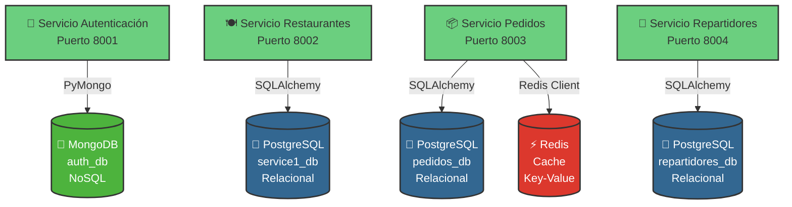
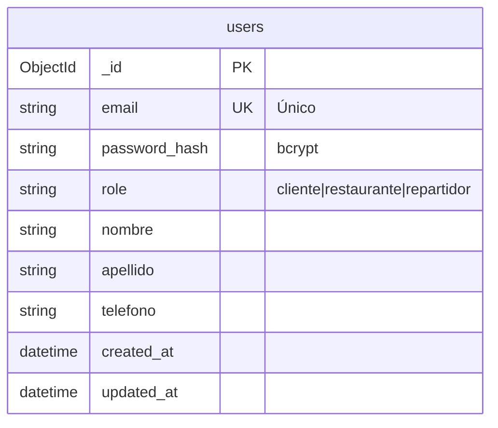
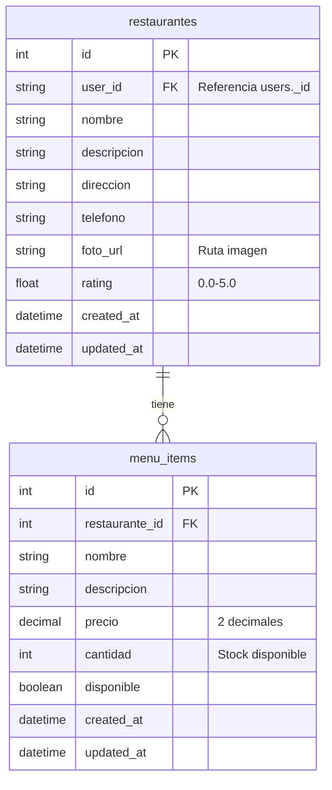
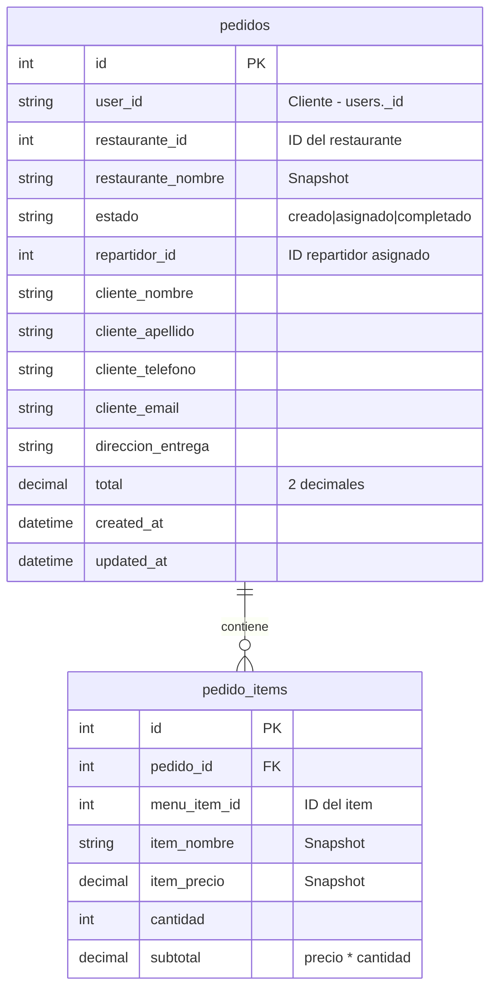
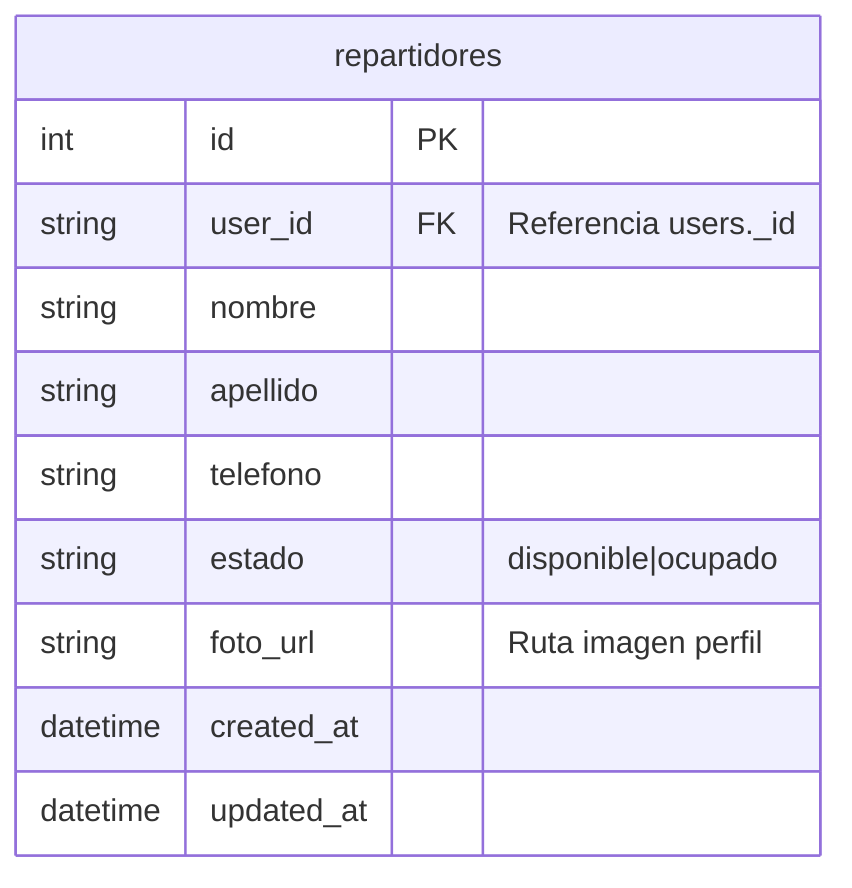
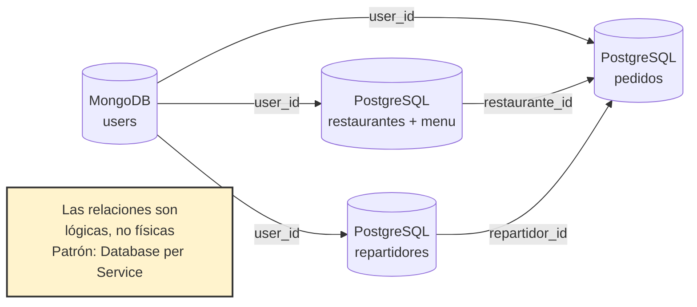

# Diagrama de Bases de Datos - Sistema Pedidos a Domicilio

## Arquitectura de Bases de Datos



## Esquema Detallado de Bases de Datos

### 🍃 MongoDB - auth_db (Autenticación)



**Colección: `users`**
- **_id**: ObjectId único de MongoDB
- **email**: Identificador único del usuario
- **password_hash**: Contraseña hasheada con bcrypt
- **role**: Tipo de usuario (cliente, restaurante, repartidor)
- Indexado por: `email` (único)

---

### 🐘 PostgreSQL - service1_db (Restaurantes)



**Tabla: `restaurantes`**
- **id**: Primary Key autoincremental
- **user_id**: Referencia al dueño en MongoDB (users._id)
- **foto_url**: Ruta al archivo de imagen en volumen Docker
- Indexado por: `user_id`

**Tabla: `menu_items`**
- **restaurante_id**: Foreign Key → restaurantes.id
- **cantidad**: Control de stock en tiempo real
- **disponible**: Flag para ocultar items sin eliminarlos
- Indexado por: `restaurante_id`

---

### 🐘 PostgreSQL - pedidos_db (Pedidos)



**Tabla: `pedidos`**
- **user_id**: Cliente que hizo el pedido (users._id)
- **restaurante_id**: Restaurante del pedido
- **estado**: Flujo del pedido (creado → asignado → completado)
- **repartidor_id**: NULL hasta asignación
- **Snapshots**: Guarda datos del restaurante en el momento del pedido
- Indexado por: `user_id`, `restaurante_id`, `estado`, `repartidor_id`

**Tabla: `pedido_items`**
- **pedido_id**: Foreign Key → pedidos.id
- **Snapshots**: Guarda nombre y precio del item en el momento
- **subtotal**: Calculado como precio × cantidad
- Indexado por: `pedido_id`

---

### 🐘 PostgreSQL - repartidores_db (Repartidores)



**Tabla: `repartidores`**
- **user_id**: Referencia al usuario en MongoDB (users._id)
- **estado**: Control de disponibilidad
  - `disponible`: Puede recibir pedidos
  - `ocupado`: Tiene pedido asignado
- **foto_url**: Imagen de perfil
- Indexado por: `user_id`, `estado`

---

### ⚡ Redis (Cache y Coordinación)

```
Key-Value Store usado para:
├── Caché de sesiones
├── Caché de consultas frecuentes
├── Coordinación de pedidos en proceso
└── Lock distribuido para asignaciones atómicas
```

**Estructura de Keys:**
```
pedido:lock:{pedido_id}          → Lock para reserva de stock
restaurante:menu:{rest_id}       → Caché de menú
repartidor:assignment:lock       → Lock para asignación atómica
stats:{restaurante_id}:{mes}     → Caché de estadísticas
```

---

## Relaciones entre Bases de Datos



### Integridad Referencial

**🔴 Importante**: Siguiendo el patrón de **Database per Service**, **NO hay Foreign Keys físicas** entre bases de datos diferentes.

Las relaciones se mantienen mediante:
- ✅ **user_id**: String que referencia `users._id` de MongoDB
- ✅ **Validación en capa de aplicación** (no BD)
- ✅ **Snapshots de datos**: Los pedidos guardan copia de información
- ✅ **APIs entre servicios**: Para obtener datos relacionados

---

## Transacciones y Concurrencia

### Operaciones Atómicas Críticas

#### 1️⃣ Reserva de Stock (Pedidos)
```sql
-- En service1_db (Restaurantes)
BEGIN;
SELECT cantidad FROM menu_items
WHERE id = ? AND restaurante_id = ?
FOR UPDATE;  -- Lock pesimista

UPDATE menu_items
SET cantidad = cantidad - ?
WHERE id = ?;
COMMIT;
```

#### 2️⃣ Asignación de Repartidores
```sql
-- En repartidores_db
BEGIN;
SELECT id FROM repartidores
WHERE estado = 'disponible'
LIMIT 1
FOR UPDATE SKIP LOCKED;  -- Evita espera

UPDATE repartidores
SET estado = 'ocupado'
WHERE id = ?;
COMMIT;
```

---

## Volúmenes Docker y Persistencia

```yaml
volumes:
  mongodb_data:       # Datos de MongoDB
  postgres_rest:      # Datos de restaurantes
  postgres_pedidos:   # Datos de pedidos
  postgres_rep:       # Datos de repartidores
  redis_data:         # Datos de Redis
  restaurant_photos:  # Imágenes de restaurantes
  repartidor_photos:  # Fotos de repartidores
```

---

## Consultas Comunes

### Dashboard de Restaurante
```sql
-- Estadísticas del mes
SELECT
    DATE(created_at) as fecha,
    COUNT(*) as total_pedidos,
    SUM(total) as total_ventas,
    SUM(CASE WHEN estado = 'completado' THEN 1 ELSE 0 END) as completados
FROM pedidos
WHERE restaurante_id = ?
  AND EXTRACT(MONTH FROM created_at) = ?
  AND EXTRACT(YEAR FROM created_at) = ?
GROUP BY DATE(created_at)
ORDER BY fecha DESC;
```

### Pedidos con Repartidor
```sql
-- Obtener pedido con items
SELECT p.*, pi.item_nombre, pi.cantidad, pi.subtotal
FROM pedidos p
LEFT JOIN pedido_items pi ON p.id = pi.pedido_id
WHERE p.id = ?;
```

### Repartidores Disponibles
```sql
-- Buscar repartidor libre
SELECT * FROM repartidores
WHERE estado = 'disponible'
LIMIT 1
FOR UPDATE SKIP LOCKED;
```

---

## Migraciones y Seed Data

### Orden de Inicialización

1. **MongoDB**: Crea base `auth_db` (automático)
2. **PostgreSQL - Restaurantes**: Crea tablas + seed de 3 restaurantes
3. **PostgreSQL - Pedidos**: Crea tablas
4. **PostgreSQL - Repartidores**: Crea tablas + seed de 1 repartidor
5. **Redis**: Inicializa vacío

### Datos de Prueba
- 3 restaurantes con menús completos
- 1 repartidor disponible (Juan Domínguez)
- Usuarios de prueba para cada rol

---

## Tecnologías de Acceso a Datos

| Base de Datos | ORM/Cliente | Servicio |
|--------------|------------|----------|
| MongoDB | PyMongo | Autenticación |
| PostgreSQL (restaurantes) | SQLAlchemy | Restaurantes |
| PostgreSQL (pedidos) | SQLAlchemy | Pedidos |
| PostgreSQL (repartidores) | SQLAlchemy | Repartidores |
| Redis | redis-py | Pedidos (cache) |

---

## Ventajas de esta Arquitectura

✅ **Independencia**: Cada servicio puede escalar su BD independientemente
✅ **Resiliencia**: Fallo en una BD no afecta otros servicios
✅ **Tecnología apropiada**: MongoDB para usuarios, PostgreSQL para datos estructurados
✅ **Rendimiento**: Redis para caché de datos calientes
✅ **Aislamiento**: Cambios en esquema no afectan otros servicios

---

**Última actualización**: Noviembre 2025
**Versión de esquema**: 1.0
