# Diagrama del Frontend - Sistema Pedidos a Domicilio

## Arquitectura del Frontend

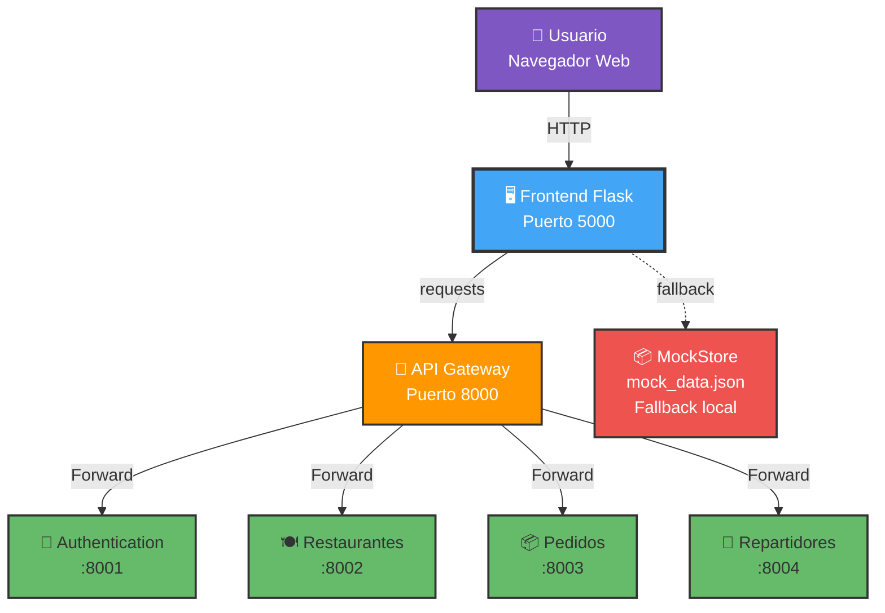

---

## Flujo de Autenticación (Login)

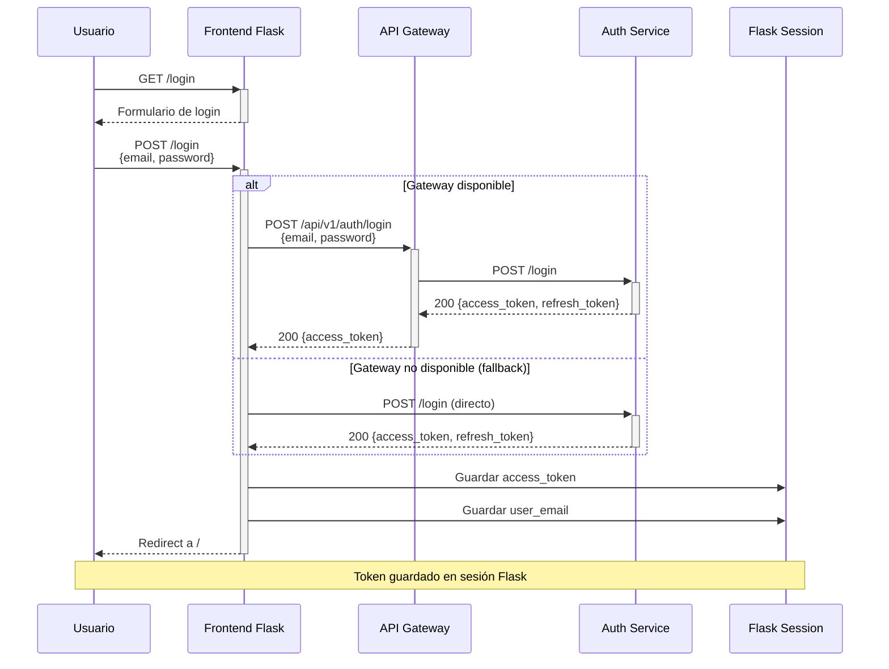

---

## Flujo de Registro de Usuario

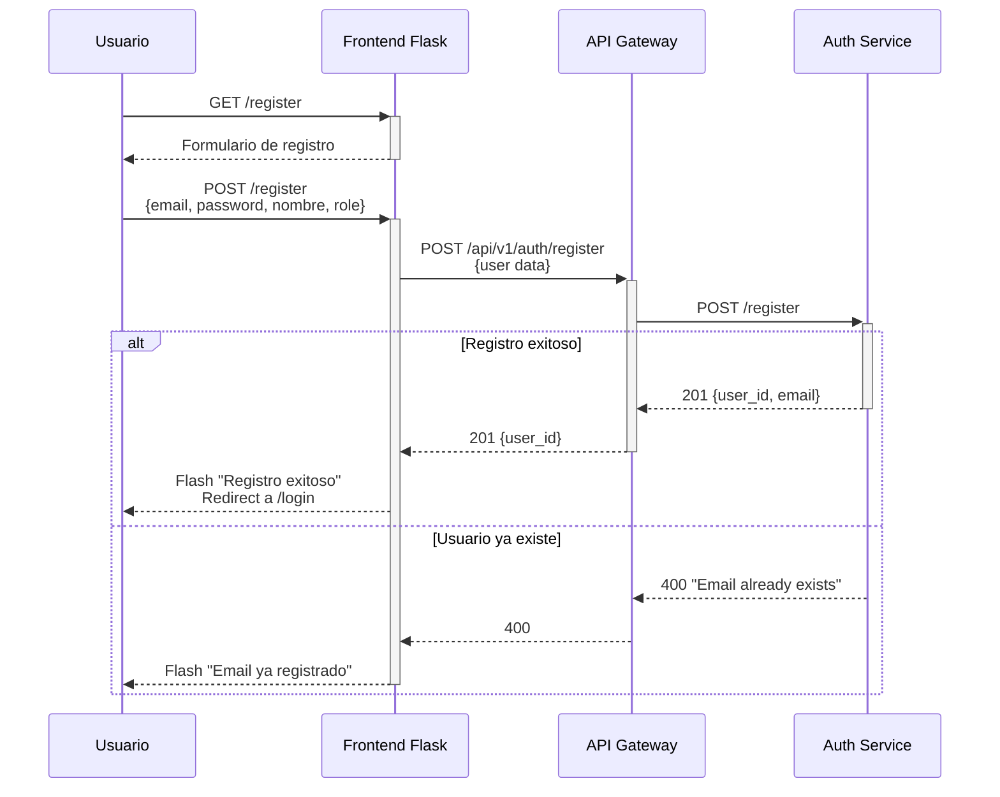

---

## Flujo de Búsqueda de Restaurantes

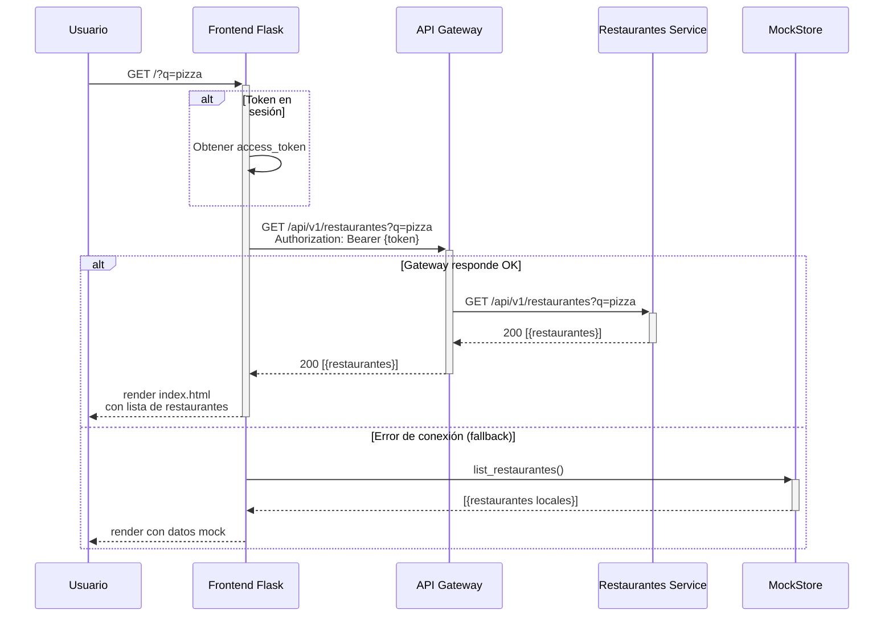

---

## Flujo de Visualización de Menú

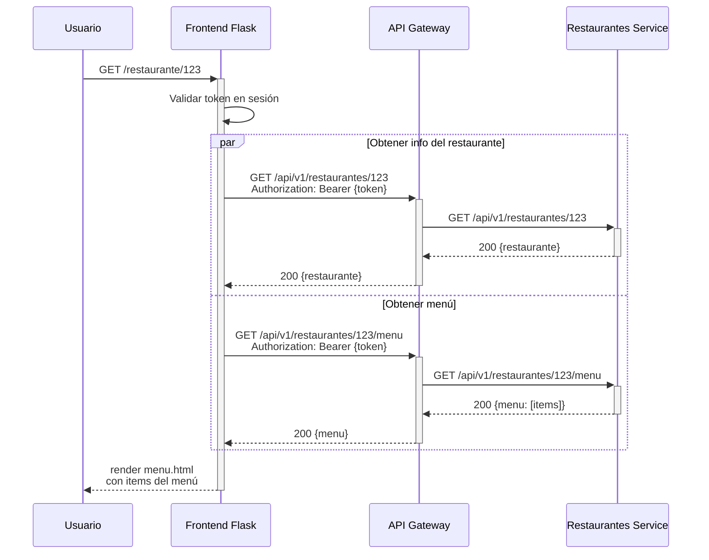

---

## Flujo de Creación de Pedido

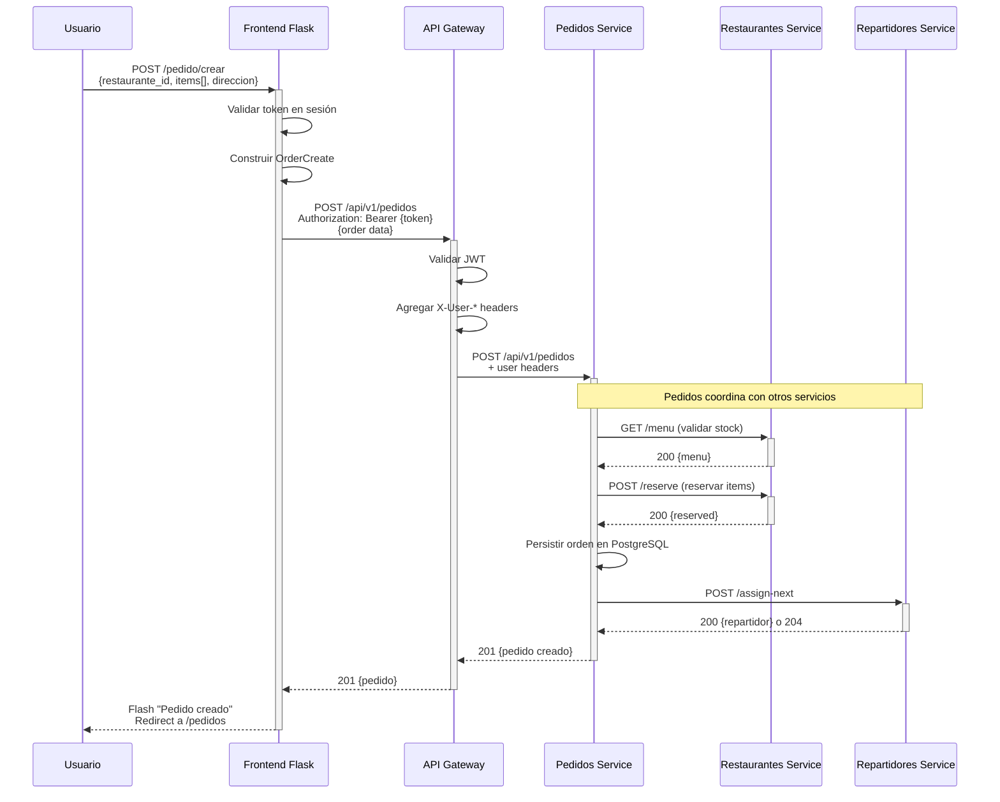

---

## Flujo de Dashboard de Restaurante

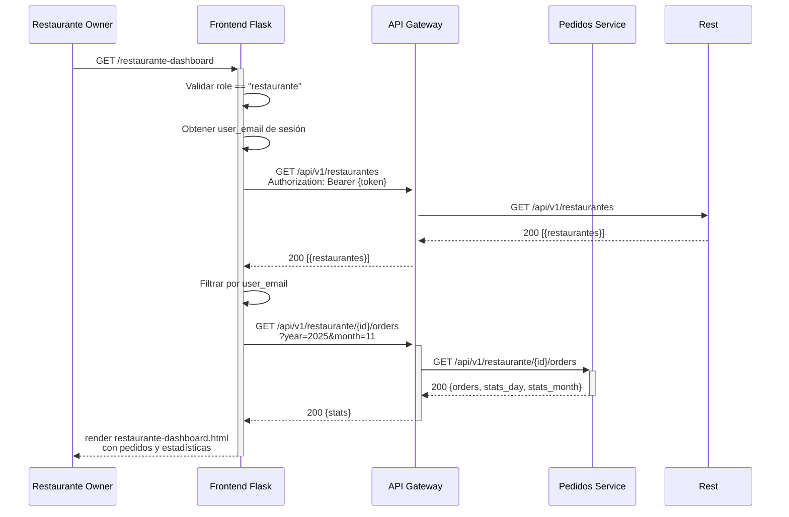

---

## Flujo de Dashboard de Repartidor

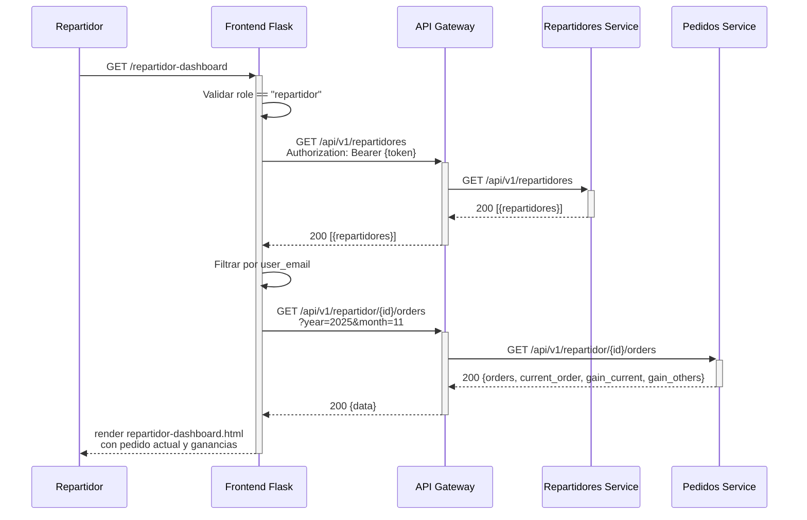

---

## Sistema de Sesiones Flask

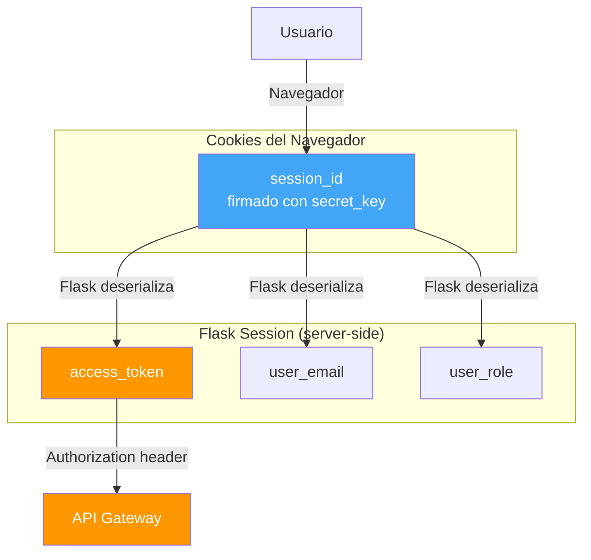

**Datos guardados en sesión:**
```python
session['access_token'] = "eyJhbGciOiJIUzI1NiIs..."
session['user_email'] = "cliente@example.com"
session['user_role'] = "cliente"  # o "restaurante" o "repartidor"
```

---

## MockStore: Sistema de Fallback

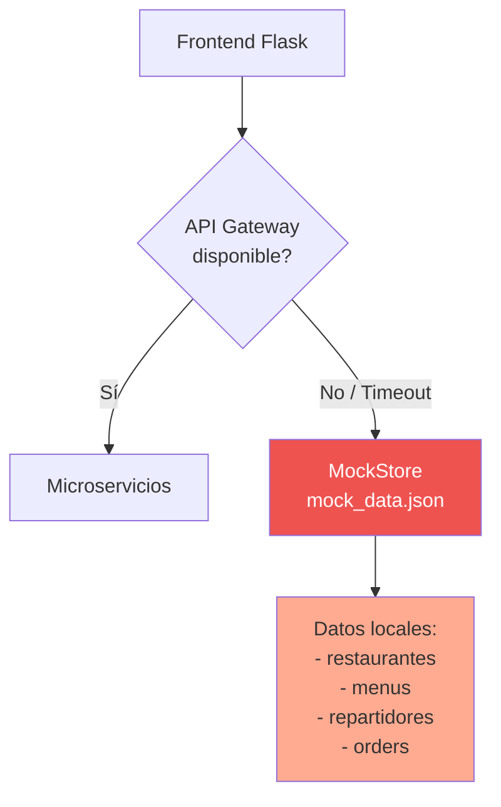

**MockStore proporciona:**
- ✅ 2 restaurantes de prueba (Pizzeria, Sushi Bar)
- ✅ Menús con items y stock
- ✅ 1 repartidor disponible
- ✅ Persistencia en JSON local
- ✅ Operaciones CRUD básicas

**Cuándo se usa:**
- Gateway no disponible (timeout)
- Error de conexión
- Servicios caídos
- Desarrollo sin Docker

---

## Rutas del Frontend

```mermaid
graph LR
    subgraph "Rutas Públicas (sin token)"
        L[/login]
        R[/register]
        H[/health]
    end

    subgraph "Rutas de Cliente"
        I[/]
        Rest[/restaurante/:id]
        CP[/pedido/crear]
        LP[/pedidos]
    end

    subgraph "Rutas de Restaurante"
        RD[/restaurante-dashboard]
        ME[/restaurante/:id/menu/editar]
    end

    subgraph "Rutas de Repartidor"
        RepD[/repartidor-dashboard]
        Complete[/pedido/:id/complete]
    end

    subgraph "Rutas API (JSON)"
        Services[/_services]
    end

    style L,R,H fill:#66bb6a,color:#fff
    style I,Rest,CP,LP fill:#42a5f5,color:#fff
    style RD,ME fill:#ff9800,color:#fff
    style RepD,Complete fill:#ab47bc,color:#fff
    style Services fill:#26c6da,color:#fff
```

### Tabla de Rutas

| Ruta | Método | Requiere Token | Role | Descripción |
|------|--------|----------------|------|-------------|
| `/login` | GET/POST | No | - | Formulario de login |
| `/register` | GET/POST | No | - | Registro de usuario |
| `/` | GET | Opcional | - | Búsqueda de restaurantes |
| `/restaurante/<id>` | GET | Sí | - | Ver menú de restaurante |
| `/pedido/crear` | POST | Sí | cliente | Crear nuevo pedido |
| `/pedidos` | GET | Sí | cliente | Listar pedidos del cliente |
| `/restaurante-dashboard` | GET | Sí | restaurante | Dashboard con estadísticas |
| `/restaurante/<id>/menu/editar` | GET/POST | Sí | restaurante | Editar menú |
| `/repartidor-dashboard` | GET | Sí | repartidor | Dashboard de repartidor |
| `/pedido/<id>/complete` | POST | Sí | repartidor | Completar pedido |
| `/_services` | GET | Sí | - | Health check de servicios (JSON) |
| `/health` | GET | No | - | Health check del frontend |

---

## Manejo de Errores y Fallback

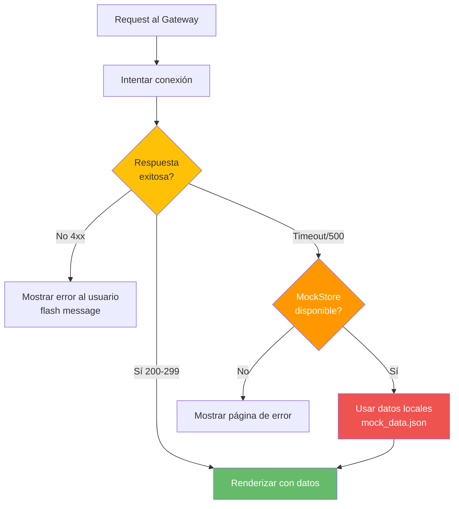

**Estrategia de fallback por ruta:**
- **Login**: Intenta Gateway → Auth directo → Error
- **Restaurantes**: Intenta Gateway → MockStore → Lista vacía
- **Pedidos**: Intenta Gateway → MockStore → Error (no puede crear)
- **Dashboard**: Intenta Gateway → Error (requiere datos reales)

---

## Comunicación Frontend → Gateway

```mermaid
graph TB
    Frontend[Frontend Flask]

    subgraph "Headers enviados"
        Auth[Authorization: Bearer {token}]
        CT[Content-Type: application/json]
        Accept[Accept: application/json]
    end

    subgraph "Métodos HTTP"
        GET[GET - Consultas]
        POST[POST - Creación]
        PUT[PUT - Actualización]
        DELETE[DELETE - Eliminación]
    end

    Frontend --> Auth
    Frontend --> CT
    Frontend --> Accept

    Frontend --> GET
    Frontend --> POST
    Frontend --> PUT
    Frontend --> DELETE

    GET --> Gateway[API Gateway<br/>:8000/api/v1/...]
    POST --> Gateway
    PUT --> Gateway
    DELETE --> Gateway

    style Frontend fill:#42a5f5,color:#fff
    style Gateway fill:#ff9800,color:#fff
    style Auth fill:#f44336,color:#fff
```

**Ejemplo de request Python:**
```python
headers = {"Authorization": f"Bearer {session['access_token']}"}
response = requests.get(
    f"{API_GATEWAY_URL}/api/v1/restaurantes",
    headers=headers,
    timeout=5
)
```

---

## Templates HTML del Frontend

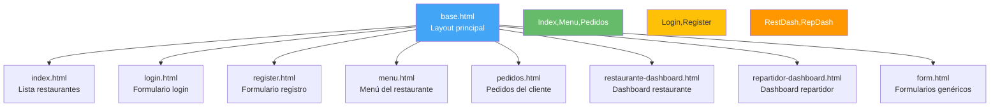

**Estructura base.html:**
- Navbar con links según role
- Sistema de flash messages
- Logout button
- CSS de Bootstrap/custom

---

## Flujo Completo: Cliente Crea Pedido

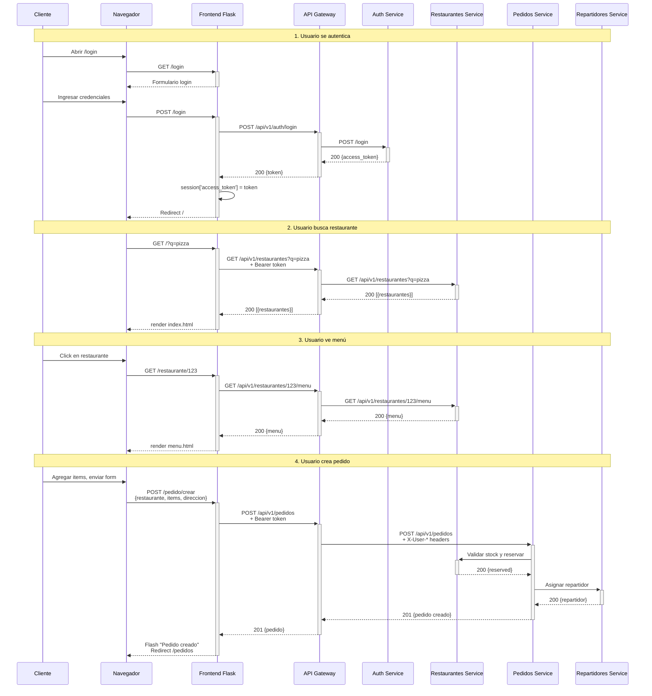

---

## Variables de Entorno

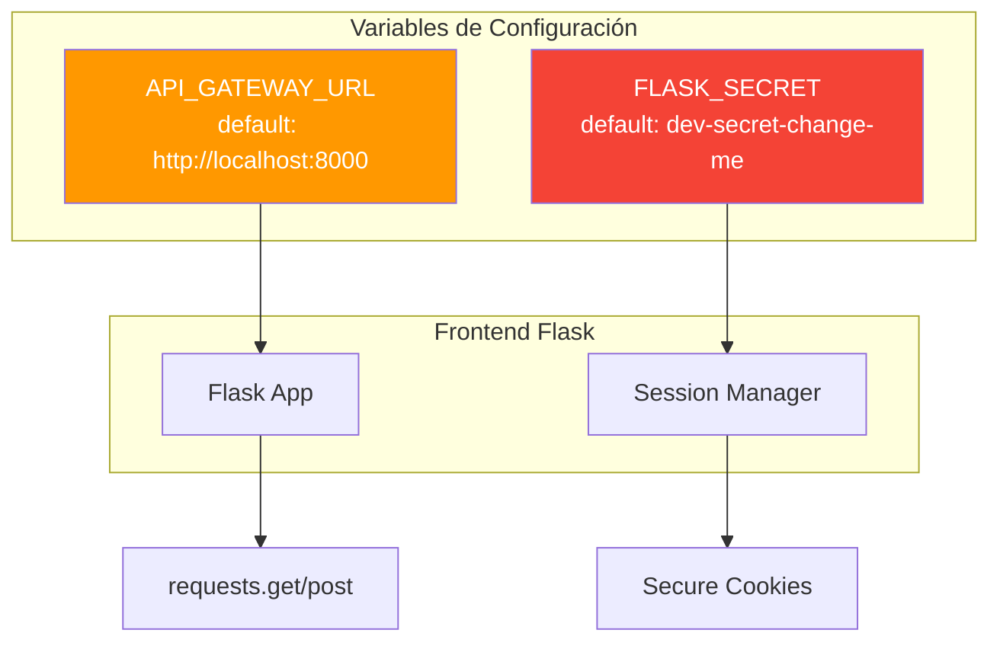

---

## Ventajas de esta Arquitectura

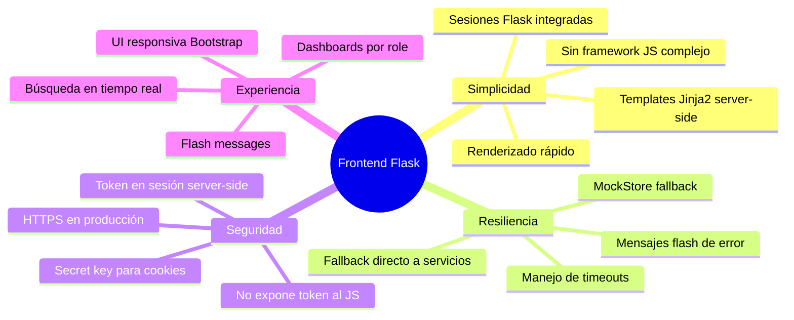

---

## Tecnologías del Frontend

| Componente | Tecnología | Propósito |
|-----------|------------|-----------|
| Framework Web | Flask | Renderizado de templates |
| Templates | Jinja2 | HTML dinámico |
| Sesiones | Flask Session | Almacenar token/user info |
| HTTP Client | requests | Llamadas al Gateway |
| CSS | Bootstrap + custom | Estilos responsivos |
| Fallback | MockStore (JSON) | Datos locales cuando servicios caen |
| Deployment | Docker | Contenedor en puerto 5000 |

---

**Última actualización**: Noviembre 2025
**Versión**: 1.0
**Puerto**: 5000
